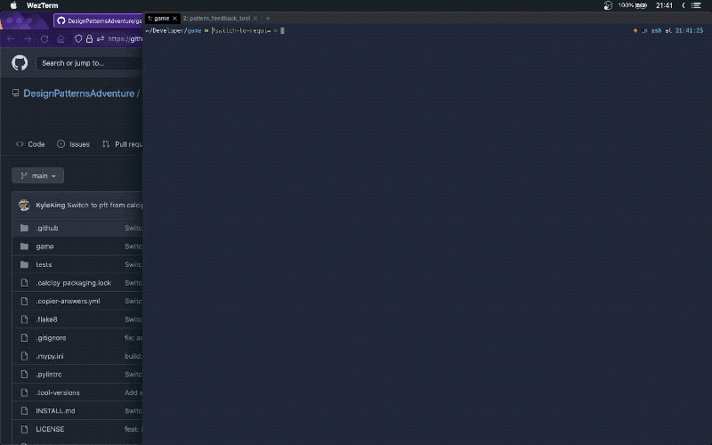

# Design Pattern Island Game

## Game Preview

You will be helping your main character build a raft to escape the main island and explore the rest of the map. As you complete each challenge, you will learn a little more about the SOLID Principles and how they can help create higher quality code.

## Installation

- Clone this repository using one of the commands from the "Code" dropdown (i.e. `gh repo clone DesignPatternsAdventure/game`)
- Install Python `>=3.10.5`
  - See our detailed walk through in [INSTALL.md](./INSTALL.md) if you don't have a version locally
- [Install graphviz from the official website](https://www.graphviz.org/download/)
  - For Mac users, this might be `brew install graphviz`, while Windows may need to download the latest `.exe` installer from the site or [use chocolatey](https://community.chocolatey.org/packages/graphviz)

## Installation Check


Make sure the Python dependencies are installed, then run `doit` to check that everything works

```sh
pip install -r requirements.txt
# Note: if you're using poetry, see instructions in 'INSTALL.md'

doit
````

If everything works, then you should see:

```sh
doit> Summary:
doit> format was successful
doit> test was successful
doit> check was successful
doit> build_diagrams was successful
````

If not, feel free to open an issue here: [https://github.com/DesignPatternsAdventure/game/issues](https://github.com/DesignPatternsAdventure/game/issues/new/choose)

## Game Play

Let's launch the game and make the first code changes!

```sh
doit play
````



This will open the game window and prompt you to complete the first task.

Once the first task is completed, you can walk around using the `WASD` or arrow keys keys.

Walk over items to pick, then press an item's inventory number (`1`) to use or equip them. When equipped, `left-click` to use the tool.

To quit the game, click the red "x" icon to close or use the keyboard shortcut `Ctrl Q` (`⌘Q` on Mac).

To reload on code changes, use the keyboard shortcut `Ctrl R` (⌘R`` on Mac).

## Shortcuts

```sh
# Run all of the default tasks
doit --continue

# Tasks can also be run one-by-one
doit run test
doit run check
```

## Attributions

* [pythonarcade/community-rpg](https://github.com/pythonarcade/community-rpg)
* [Pipoya Free RPG Tileset 32x32](https://pipoya.itch.io/pipoya-rpg-tileset-32x32)
* [Pipoya Free RPG Character Sprites 32x32](https://pipoya.itch.io/pipoya-free-rpg-character-sprites-32x32)
* [Pipoya Free RPG Character Sprites Nekonin](https://pipoya.itch.io/pipoya-free-rpg-character-sprites-nekonin)
* [Kenney Input Prompts Pixel 16x16](https://kenney.nl/assets/input-prompts-pixel-16)
* [Gentle Cat Studios Pixel 16x16](https://gentlecatstudio.itch.io/rpg-items)
